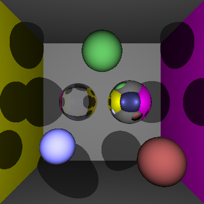
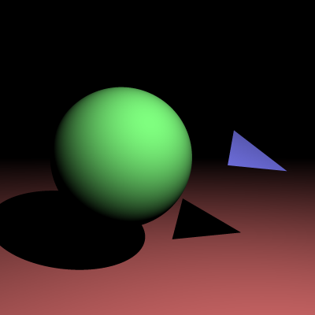

# COMP30019 Assignment 1 - Ray Tracer
This is your README.md... you should write anything relevant to your implementation here.

Please ensure your student details are specified below (*exactly* as on UniMelb records):

**Name:** Jeremy(Fu-Sheng) Huang\
**Username:** FuShengK \

## Completed stages

Tick the stages bellow that you have completed so we know what to mark (by editing README.md). At most **six** marks can be chosen in total for stage three. If you complete more than this many marks, pick your best one(s) to be marked!


##### Stage 1

- [x] Stage 1.1 - Familiarise yourself with the template
- [x] Stage 1.2 - Implement vector mathematics
- [x] Stage 1.3 - Fire a ray for each pixel
- [x] Stage 1.4 - Calculate ray-entity intersections
- [x] Stage 1.5 - Output primitives as solid colours

##### Stage 2

- [x] Stage 2.1 - Diffuse materials
- [X] Stage 2.2 - Shadow rays
- [x] Stage 2.3 - Reflective materials
- [x] Stage 2.4 - Refractive materials
- [x] Stage 2.5 - The Fresnel effect
- [x] Stage 2.6 - Anti-aliasing

##### Stage 3

- [x] Option A - Emissive materials (+6)
- [x] Option B - Ambient lighting/occlusion (+6)
- [ ] Option C - OBJ models (+6)
- [ ] Option D - Glossy materials (+3)
- [x] Option E - Custom camera orientation (+3)
- [ ] Option F - Beer's law (+3)
- [x] Option G - Depth of field (+3)

*Please summarise your approach(es) to stage 3 here.*


## Final scene render

Be sure to replace ```./images/final_scene.png``` with your final render so it shows up here:



This render took **x** minutes and **y** seconds on my PC.

I used the following command to render the image exactly as shown:

```
dotnet run -- -f tests/final_scene.txt -o images/final_scene.png
```

## Sample outputs

We have provided you with some sample tests located at ```/tests/*```. So you have some point of comparison, here are the outputs our ray tracer solution produces for given command line inputs (for the first two stages, left and right respectively):

###### Sample 1
```
dotnet run -- -f tests/sample_scene_1.txt -o images/sample_scene_1.png -x 4
```
<p float="left">
  
   
</p>

###### Sample 2

```
dotnet run -- -f tests/sample_scene_2.txt -o images/sample_scene_2.png -x 4
```
<p float="left">
  
   
</p>

## References

*You must list any references you used!*

To get you started, here is some good reading material:

Working through a ray tracer, from the head of the xbox games studio: https://www.linkedin.com/pulse/writing-simple-ray-tracer-c-matt-booty/

*Ray Tracing in a Weekend*: https://raytracing.github.io/

Great walkthrough of some of the basic maths: https://blog.scottlogic.com/2020/03/10/raytracer-how-to.html

Ray Tracing Basics: https://web.cse.ohio-state.edu/~shen.94/681/Site/Slides_files/basic_algo.pdf

Scratchapixel: intro to ray tracing: https://www.scratchapixel.com/lessons/3d-basic-rendering/introduction-to-ray-tracing/how-does-it-work

Fast, Minimum Storage Ray/Triangle Intersection: https://fileadmin.cs.lth.se/cs/Personal/Tomas_Akenine-Moller/code/raytri_tam.pdf